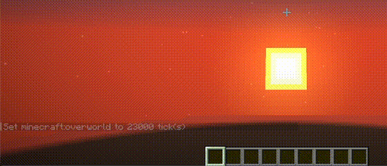

	 
		
    <h1 align="center"> Command R </h1>
	 

In three words, this is "*reverse-i-search for Minecraft*".

Command R is a mod that brings search functionality to your Minecraft chat messages and commands. If you've ever used `reverse-i-search` in a Bash, Zsh, or Powershell terminal, this is basically the same.

Here is a 30-second video showcasing Command R:

## How to Use

- Activate Search: Activate Search Mode while the chat is open. Use the "Next" keybind (CTRL + R default)

- Next: Find the next item (in reverse) that matches your search query.

- Previous: Go back to the previous item (go forward) that last matched your search query. Use the "Previous" keybind (CTRL + SHIFT + R default)

- Change Keybinds: You can change the keybinds above in Options > Controls > Keybinds > Command R

## Support & Contribution

Feel free to go through GitHub issues tracker or create a new Issue. However, If there is a change you want made, consider contributing!